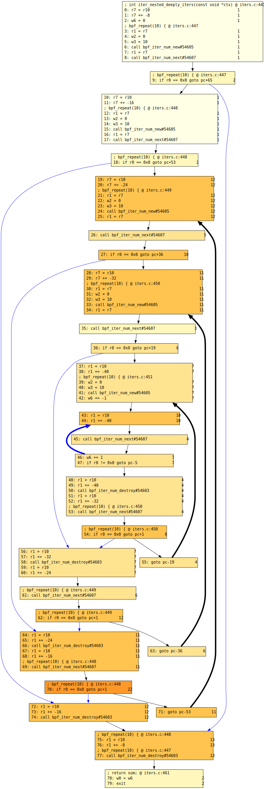

Converts a level 2 BPF verifier log into an annotated control flow
graph (CFG) and outputs it in DOT format. BPF instructions and
corresponding C lines are grouped into basic blocks, with each
instruction annotated by the number of times the verifier has visited
it.

### Output Conventions:
- More intense basic block colors indicate more frequent visits.
- Blue edges represent true branches in conditionals.
- Bold edges indicate back-edges.

### Usage:
```
log2dot [-h] [-o dot_file] [log_file]
```

### Parameters:
- **`log_file`**: A verifier log produced with `BPF_LOG_LEVEL2`.
  If omitted, input is read from `stdin`.
- **`dot_file`**: The output file name.
  If omitted, output is written to `stdout`.

### Dependencies:
- The `pydot` package is required to generate the graph. It can be installed via:
  ```
  pip3 install pydot
  ```
  or using a distribution package manager, e.g.:
  ```
  dnf install python3-pydot  # Fedora
  ```

### Example Usage:
```
$ veristat -vl2 -f iter_nested_deeply_iters iters.bpf.o > test.log
$ log2dot.py test.log | xdot -
```
Here, `xdot` is used for interactive visualization of the generated DOT file.


